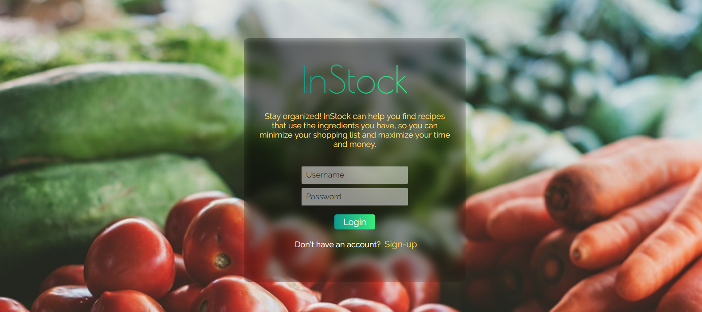
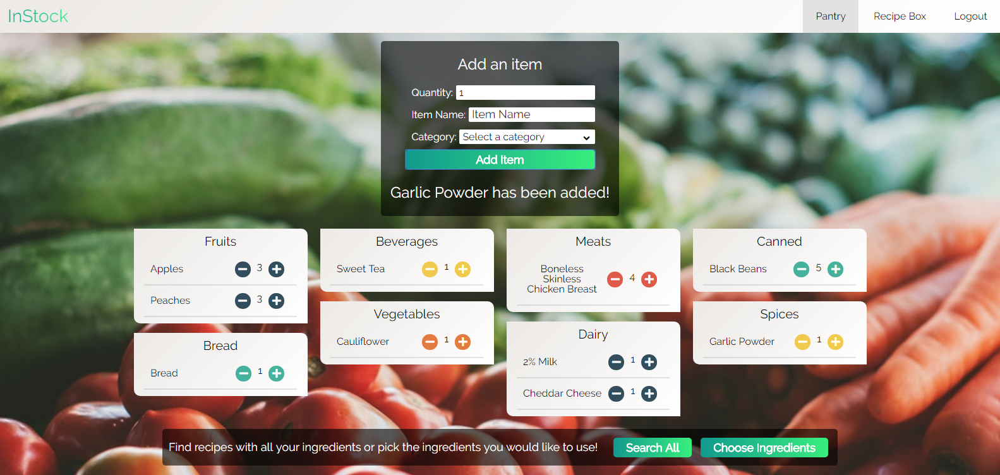

# InStock

An app to help the user track, maintain, and use the food items they have at home. Users can categorize and track the quantity of each item, maintaining a virtual pantry to help simplify the grocery shopping experience. Users then have a choice to search for recipes that maximize the use of all the ingredients they have on hand, or make a custom recipe search, specifying the ingredients they would like to use. This helps simplify the decision of what to cook while saving the user money by using whats in stock. 

## Demo

Checkout the [Live Demo](https://instock-pantry-app.herokuapp.com/)

## Screenshots

### Login Screen

### Sign-up Screen

### Pantry - Main Screen

#### Choose Ingredients

#### Custom Recipe search

#### Recipe Details
 
 
 
 
 ### Recipe Box
 
 
 ## Built With
 
 ### Front-End
 - HTML
 - CSS 
 - JavaScript
 - jQuery
 
 ### Back-End
 - Node.js
 - Express
 - MongoDB
 - Mongoose
 - Chai
 - Mocha
 
 ### Authentication
 - Passport
 - JSON Web Tokens
 
 ### API
 - [Spoonacular Recipe API](https://spoonacular.com/food-api)
